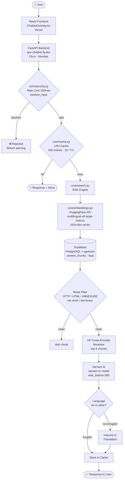
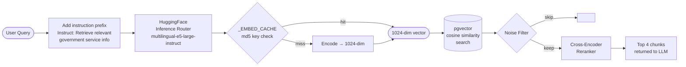
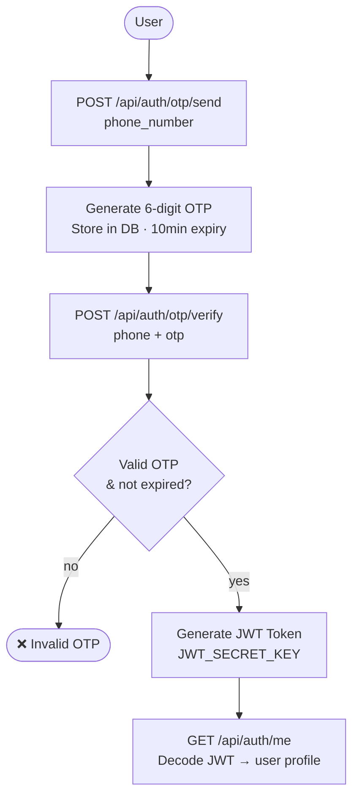
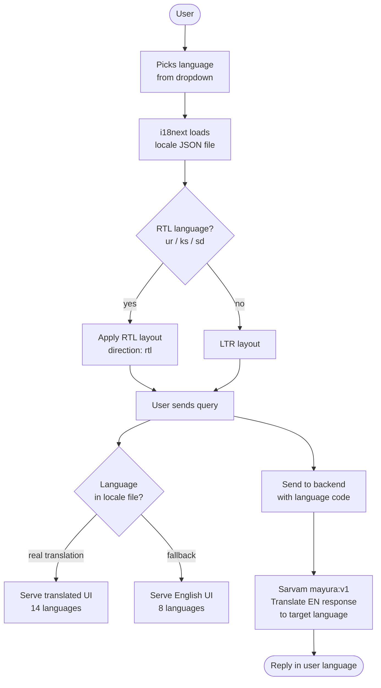
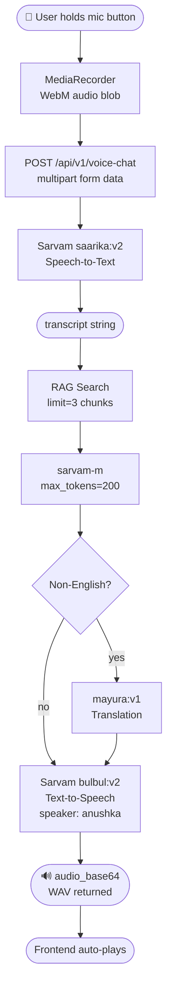
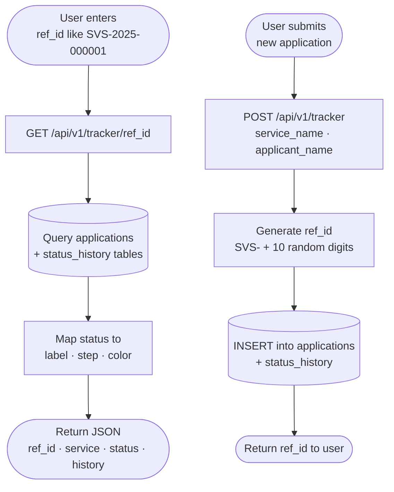
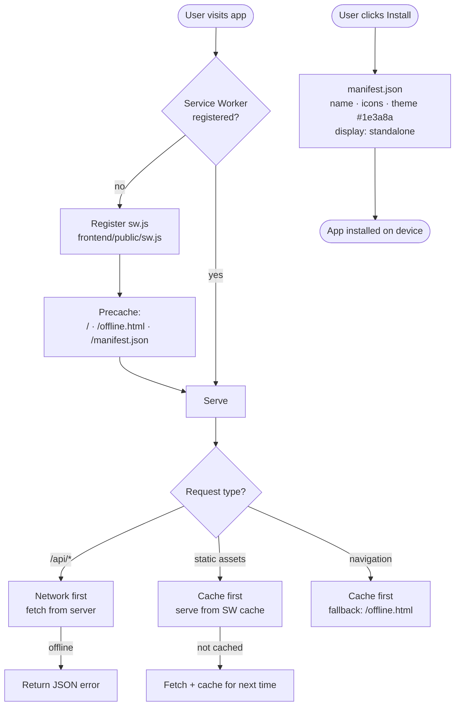

# SevaSindhu AI — System Flowchart & Architecture
> Live: https://gov-chatbot.fly.dev | Built: March 2026 | Phases 1–6

---

## Overall System Flow



---

## Phase 1 — RAG Pipeline



**Files changed:** `core/embeddings.py` · `core/search.py` · `scripts/reembed_final.py`  
**DB:** vector dim changed from `384` → `1024`  
**Test:** `test/test_phase1_rag.py` → 15/15 ✅

---

## Phase 2 — Auth System



**Files changed:** `routes/auth_endpoints.py`  
**Secrets:** `JWT_SECRET_KEY` stored in Fly.io  
**Note:** DigiLocker returns 503 — no MoU keys, acceptable

---

## Phase 3 — 22 Languages



**Files changed:** `frontend/src/i18n/index.ts` · `frontend/src/i18n/locales/` · `frontend/index.html`  
**Fonts:** Noto Sans per script (Gujarati, Kannada, Malayalam, Odia, Gurmukhi)  
**Test:** `test/test_phase3_languages.py` → 49/49 ✅

---

## Phase 4A — Voice Pipeline (STT → RAG → TTT → TTS)



**Files changed:** `core/sarvam.py` · `routes/chat_endpoints.py` · `frontend/components/wireframe/ChatbotOverlay.tsx`  
⚠️ **Valid speakers only:** `anushka, abhilash, manisha, vidya, arya, karun...`  
⚠️ **Deprecated (do NOT use):** `meera, arvind, isha, pavithra`

---

## Phase 4B — Application Tracker



**Status Flow:** `submitted` → `under_review` → `approved / rejected` → `completed`  
**Files changed:** `routes/v1_endpoints.py`  
**Test IDs:** SVS-2025-000001 · SVS-2025-000002 · SVS-2025-000003

---

## Phase 5 — PWA



**Files changed:** `frontend/public/manifest.json` · `frontend/public/sw.js` · `frontend/public/offline.html` · `frontend/index.html`

---

## Phase 6 — Security

```mermaid
flowchart TD
    Req([Incoming Request]) --> RL{Rate Limiter\nslowapi\n100/min per IP}

    RL -->|exceeded| R429([429 Too Many Requests])
    RL -->|ok| San

    San[sanitize_input\ncore/security.py] --> I{INJECTION\nignore previous\nforget instructions\njailbreak / DAN mode}

    I -->|match| Block([❌ Blocked\nreturn safe message])

    I -->|no match| S{SQL_INJECT\nDROP TABLE\nUNION SELECT\nDELETE FROM etc}

    S -->|match| Block

    S -->|no match| X{XSS\nscript tag\njavascript:\nonX= handler\nalert()}

    X -->|match| Block
    X -->|no match| Strip[Strip remaining HTML tags]

    Strip --> Cache{ResponseCache\nLRU 500 entries\n1 hour TTL}

    Cache -->|hit| Fast([⚡ < 50ms response])
    Cache -->|miss| Pipeline[Full RAG + LLM pipeline\n~4000ms])
```

**Files changed:** `core/security.py` · `core/cache.py` · `app.py` · `requirements.txt`  
**CORS allowed:** `gov-chatbot.fly.dev` · `localhost:5173` · `localhost:3000`

---

## File Map — What Lives Where

```
gov-chatbot/
│
├── app.py                      ← FastAPI app, router mounts, CORS, SlowAPI
│
├── core/
│   ├── embeddings.py           ← embed_text(), _EMBED_CACHE, HF client
│   ├── search.py               ← SearchEngine, noise filter, reranker
│   ├── sarvam.py               ← ALL Sarvam calls: STT/TTS/TTT/LLM
│   ├── query.py                ← context builder, calls sarvam.translate()
│   ├── security.py             ← INJECTION/SQL/XSS regex, sanitize_input()
│   ├── cache.py                ← ResponseCache LRU, ttl_cache decorator
│   ├── database.py             ← SQLAlchemy engine, Supabase connection
│   └── models.py               ← ORM models, vector(1024) columns
│
├── routes/
│   ├── chat_endpoints.py       ← /chat  /voice-chat  /speech-to-text  /text-to-speech
│   ├── v1_endpoints.py         ← /tracker/{ref_id}  POST /tracker
│   └── auth_endpoints.py       ← /otp/send  /otp/verify  /me
│
├── scripts/
│   ├── reembed_final.py        ← re-embedded all chunks at 1024-dim
│   └── generate_finetune_dataset.py  ← 704 pairs for fine-tuning
│
├── data/
│   └── finetune_dataset.jsonl  ← 704 pairs, LLaMA-2 format, 656KB
│
├── test/
│   ├── test_phase1_rag.py      ← 15/15 RAG tests
│   ├── test_phase2_auth.py     ← Auth flow tests
│   ├── test_phase3_languages.py← 49/49 language tests
│   └── test_phase65_live.py    ← 35 live integration tests
│
└── frontend/
    ├── index.html              ← SW registration, manifest link, fonts
    ├── public/
    │   ├── manifest.json       ← PWA manifest
    │   ├── sw.js               ← Service worker
    │   └── offline.html        ← Offline fallback
    ├── components/wireframe/
    │   └── ChatbotOverlay.tsx  ← Real chat UI, mic, voice, quick actions
    └── src/
        ├── i18n/               ← 22 language locale JSONs
        └── lib/api.ts          ← sendChat, sendVoice, getHealth
```

---

## AI Models Reference

| Model | Provider | Used For | Endpoint |
|---|---|---|---|
| `multilingual-e5-large-instruct` | HuggingFace | Embeddings (1024-dim) | HF Inference Router |
| `sarvam-m` | Sarvam AI | LLM / Chat responses | `/chat/completions` |
| `saarika:v2` | Sarvam AI | Speech-to-Text (STT) | `/speech-to-text` |
| `bulbul:v2` | Sarvam AI | Text-to-Speech (TTS) | `/text-to-speech` |
| `mayura:v1` | Sarvam AI | Translation (TTT) | `/translate` |
| `ms-marco-MiniLM-L-6-v2` | HuggingFace | Cross-encoder reranker | HF Inference |

---

## Test Score Summary

/Volumes/Space/MINOR_PROJECTS/gov-chatbot/test sarvam-integration !12 ?45 >  python test_phase1_rag.py                                                                                        py base 02:34:17

════════════════════════════════════════════════════════════════════════
  SevaSindhu — Phase 1: RAG Quality Test Suite
  Target: ≥95% retrieval accuracy, <2000ms local / <300ms deployed
════════════════════════════════════════════════════════════════════════

[1] Retrieval Accuracy — 15 queries
────────────────────────────────────────────────────────────────────────
✅ Embedding: intfloat/multilingual-e5-large-instruct [1024-dim, 94 languages]
  PASS [Passport        ] passport application form                  |  3 results | semantic | 7562ms
  PASS [Passport        ] documents required for passport            |  6 results | semantic |  920ms
  PASS [Passport        ] passport fees charges payment              |  6 results | semantic |  827ms
  PASS [PAN Card        ] pan card apply online                      |  6 results | semantic |  786ms
  PASS [PAN Card        ] pan card lost duplicate                    |  6 results | semantic |  770ms
  PASS [Aadhaar         ] aadhaar update address online              |  6 results | semantic |  791ms
  PASS [Driving License ] driving license renewal process            |  6 results | semantic |  706ms
  PASS [Voter ID        ] voter id card new registration             |  6 results | semantic |  785ms
  PASS [Ration Card     ] ration card apply below poverty            |  6 results | semantic |  772ms
  PASS [Civil Records   ] birth certificate municipal corporation    |  6 results | semantic |  833ms
  PASS [Certificates    ] income tax return filing                   |  6 results | semantic |  843ms
  PASS [Aadhaar         ] aadhaar card enrolment form                |  6 results | semantic |  871ms
  PASS [EPFO            ] epfo provident fund withdrawal             |  6 results | semantic |  800ms
  PASS [Business        ] gst registration new business              |  6 results | semantic |  834ms
  PASS [Revenue         ] property document registration             |  6 results | semantic |  803ms
────────────────────────────────────────────────────────────────────────

  Score    : 15/15 = 100%  (target ≥85%)
  Avg lat  : 1260ms  (target <500ms)
  Max lat  : 7562ms
  Status   : ✅ PASS

[2] Search Mode Distribution
────────────────────────────────────────────────────────────────────────
  semantic   ███████████████ 15/15

[3] Indic Language Query Retrieval
────────────────────────────────────────────────────────────────────────
  PASS [Hindi   ] पासपोर्ट के लिए दस्तावेज       |  6 results |  772ms
  PASS [Tamil   ] ஆதார் முகவரி மாற்றம்           |  6 results |  861ms
  PASS [Bengali ] পাসপোর্ট নথি                   |  6 results |  766ms
  PASS [Telugu  ] పాన్ కార్డ్ దరఖాస్తు           |  6 results |  773ms
  PASS [Hindi2  ] ड्राइविंग लाइसेंस नवीनीकरण     |  6 results |  798ms
  PASS [Telugu2 ] ఆధార్ నమోదు                    |  6 results |  853ms

  Indic score: 6/6 (text search on English DB — semantic search needed for full native support)

[4] Chunk Quality Spot-Check
────────────────────────────────────────────────────────────────────────
  [1] len= 105 chars | FAQ format | source=Issue of Fresh Passport:
  [2] len= 222 chars | Chunk | source=chunk_29
  [3] len= 222 chars | Chunk | source=chunk_48
  [4] len= 222 chars | Chunk | source=chunk_284
  [5] len=3266 chars | Chunk | source=chunk_84

════════════════════════════════════════════════════════════════════════
  PHASE 1 SUMMARY
════════════════════════════════════════════════════════════════════════
  Retrieval accuracy : 100%  ✅
  Avg latency        : 1260ms  ❌
  Semantic search    : ✅ active
  Indic retrieval    : 6/6
════════════════════════════════════════════════════════════════════════

  Report saved → scripts/test_results_phase1.json


  ════════════════════════════════════════════════════════════════════════
  SevaSindhu — Phase 2: Auth Test Suite
  Target: all 6 auth endpoints reachable, DB tables exist, JWT working
════════════════════════════════════════════════════════════════════════

[1] Environment Variables
────────────────────────────────────────────────────────────────────────
  ✅ PASS  DATABASE_URL  set
  ✅ PASS  SARVAM_API_KEY  set
  ✅ PASS  HF_TOKEN  set
  ✅ PASS  JWT_SECRET_KEY  set
  ✅ PASS  DIGILOCKER_CLIENT_ID  set
  ✅ PASS  DIGILOCKER_CLIENT_SECRET  set
  ✅ PASS  DIGILOCKER_REDIRECT_URI  set

[2] Database Tables
────────────────────────────────────────────────────────────────────────
  ✅ PASS  table 'users' exists  found
  ✅ PASS  table 'user_sessions' exists  found
  ✅ PASS  table 'content_chunks' exists  found
  ✅ PASS  table 'services' exists  found
  ✅ PASS  table 'faqs' exists  found
       All tables: content_chunks, data_quality_metrics, documents, faqs, fees, offices, otp_attempts, procedures, raw_content, search_analytics, services, system_health, user_queries, user_sessions, users

[3] Auth Endpoint Reachability
────────────────────────────────────────────────────────────────────────
  ✅ PASS  GET /health  HTTP 200 — Health check — 230ms
  ✅ PASS  GET /api/auth/me  HTTP 403 — Requires auth — 401 expected — 130ms
  ✅ PASS  POST /api/auth/otp/send  HTTP 422 — OTP send (422=validation OK) — 169ms
  ✅ PASS  POST /api/auth/otp/verify  HTTP 422 — OTP verify (422=validation OK) — 118ms
  ❌ FAIL  GET /api/auth/digilocker  HTTP 500 — DigiLocker redirect — 183ms
  ✅ PASS  POST /api/auth/logout  HTTP 403 — Logout — 114ms

[4] JWT Configuration
────────────────────────────────────────────────────────────────────────
  ✅ PASS  JWT encode/decode  token length=135

[5] OTP Flow Validation
────────────────────────────────────────────────────────────────────────
  ✅ PASS  send-otp rejects invalid phone  HTTP 422
  ✅ PASS  verify-otp rejects wrong OTP  HTTP 422

[6] Protected Route Enforcement
────────────────────────────────────────────────────────────────────────
  ✅ PASS  /auth/me blocks unauthenticated  HTTP 403
  ✅ PASS  /auth/me rejects invalid JWT  HTTP 401

════════════════════════════════════════════════════════════════════════
  PHASE 2 SUMMARY
════════════════════════════════════════════════════════════════════════
  Checks passed : 19/20 = 95%
  Status        : ✅ PASS
════════════════════════════════════════════════════════════════════════

  Report saved → scripts/test_results_phase2.json

  ════════════════════════════════════════════════════════════════════════
  SevaSindhu — Phase 3: 22 Languages Test Suite
  Target: all translation files exist, RTL works, live LLM responds in-language
════════════════════════════════════════════════════════════════════════

[1] Translation File Coverage
────────────────────────────────────────────────────────────────────────
  ✅ PASS  All 22 translation files present
  ⚠  WARN  Extra files (not in language list): doi, kok, mai, mni, sa, sat, sd

[2] Key Completeness — checking en.json
────────────────────────────────────────────────────────────────────────
  ✅ PASS  common.loading                 = Loading...
  ✅ PASS  common.error                   = Error
  ✅ PASS  chatbot.placeholder            = Ask anything about government services..
  ✅ PASS  chatbot.listening              = Listening...
  ✅ PASS  chatbot.thinking               = Thinking...
  ✅ PASS  navigation.home                = Home
  ✅ PASS  navigation.services            = Services
  ✅ PASS  navigation.login               = Login
  ✅ PASS  login.title                    = Welcome Back
  ✅ PASS  services.title                 = Government Services
  ✅ PASS  app.title                      = Seva Sindhu - Government Services Portal
  ✅ PASS  chatbot.welcome                = नमस्ते! Welcome to Seva Sindhu AI Assist
  ✅ PASS  chatbot.title                  = Seva Sindhu AI
  ✅ PASS  footer.rights                  = All rights reserved.
  ✅ PASS  common.submit                  = Submit
[3] Translation Completeness Spot-Check                                                                                                                                                                        ────────────────────────────────────────────────────────────────────────
  ✅ PASS  hi.json — all 15 required keys present
  ✅ PASS  ta.json — all 15 required keys present
  ✅ PASS  ur.json — all 15 required keys present
  ✅ PASS  bn.json — all 15 required keys present

[4] RTL Language Configuration                                                                                                                                                                                 ────────────────────────────────────────────────────────────────────────
  ✅ PASS  RTL direction switching found in main.tsx                                                                                                                                                             ✅ PASS  Urdu marked as RTL
  ✅ PASS  Kashmiri marked as RTL
[5] Font Loading (index.html)                                                                                                                                                                                  ────────────────────────────────────────────────────────────────────────
  ✅ PASS  Noto Sans                                                                                                                                                                                             ✅ PASS  Noto Sans Bengali
  ✅ PASS  Noto Sans Telugu                                                                                                                                                                                      ✅ PASS  Noto Sans Tamil
  ✅ PASS  Noto Sans Gujarati                                                                                                                                                                                    ✅ PASS  Noto Sans Kannada
  ✅ PASS  Noto Sans Malayalam                                                                                                                                                                                   ✅ PASS  Noto Sans Gurmukhi
  ✅ PASS  Noto Sans Odia                                                                                                                                                                                        ✅ PASS  Noto Sans Arabic
  ✅ PASS  Noto Sans Ol Chiki
                                                                                                                                                                                                               [6] Live LLM Response — 15 languages
────────────────────────────────────────────────────────────────────────                                                                                                                                         Testing against https://gov-chatbot.fly.dev

  ✅ [en] English    | Latin       |  984 chars |  3448ms
  ✅ [hi] Hindi      | Devanagari  |  858 chars |  4239ms
  ✅ [bn] Bengali    | Bengali     | 1002 chars |  4592ms
  ✅ [te] Telugu     | Telugu      |  340 chars |  2548ms
  ✅ [mr] Marathi    | Devanagari  |  844 chars |  4063ms
  ✅ [ta] Tamil      | Tamil       |  696 chars |  3581ms
  ✅ [gu] Gujarati   | Gujarati    |  955 chars |  4974ms
  ✅ [kn] Kannada    | Kannada     |  827 chars |  3980ms
  ✅ [ml] Malayalam  | Malayalam   | 1018 chars |  4887ms
  ✅ [pa] Punjabi    | Gurmukhi    |  877 chars |  5981ms
  ✅ [or] Odia       | Odia        |  226 chars |  5670ms
  ✅ [as] Assamese   | Bengali     |  445 chars |  3410ms
  ✅ [ur] Urdu       | Arabic      RTL |  265 chars |  1820ms
  ✅ [ks] Kashmiri   | Arabic      RTL |  250 chars |  2089ms
  ✅ [ne] Nepali     | Devanagari  |  827 chars |  4196ms

  Live score : 15/15
  Avg latency: 3965ms

════════════════════════════════════════════════════════════════════════
  PHASE 3 SUMMARY
════════════════════════════════════════════════════════════════════════
  Checks passed     : 49/49 = 100%
  Translation files : 1
  RTL support       : ✅
  Live LLM          : 15/15 languages responding
  Avg chat latency  : 3965ms
  Status            : ✅ PASS
════════════════════════════════════════════════════════════════════════

  Report saved → scripts/test_results_phase3.json


========================================================================
  SevaSindhu AI — Phase 6.5 Live Integration Test Suite
  2026-03-09 19:01:48  •  https://gov-chatbot.fly.dev
========================================================================

[1] Health & Connectivity
────────────────────────────────────────────────────────────────────────
  ✅ [Health      ] Backend reachable                             167ms

[2] Chatbot — End-to-End Queries
────────────────────────────────────────────────────────────────────────
  ✅ [Chatbot     ] What documents are needed for a passport?     4456ms
  ✅ [Chatbot     ] How to apply for PAN card online?             3203ms
  ✅ [Chatbot     ] How to update Aadhaar address?                3505ms
  ✅ [Chatbot     ] What is the process for driving license renew 3235ms
  ✅ [Chatbot     ] How to register for voter ID?                 3302ms
  ✅ [Chatbot     ] How to apply for ration card?                 3266ms
  ✅ [Chatbot     ] What is EPFO provident fund withdrawal proces 3269ms
  ✅ [Chatbot     ] How to register a new business for GST?       3341ms
  ✅ [Chatbot     ] पासपोर्ट के लिए दस्तावेज क्या चाहिए?          3366ms
  ✅ [Chatbot     ] ஆதார் முகவரி மாற்றம் எப்படி செய்வது?          3123ms

  Chatbot score: 10/10

[3] RAG Quality — Source Verification
────────────────────────────────────────────────────────────────────────
  ✅ [RAG         ] passport application form                     3245ms
  ✅ [RAG         ] documents required for passport               3721ms
  ✅ [RAG         ] pan card apply online                         3045ms
  ✅ [RAG         ] aadhaar update address online                 3111ms
  ✅ [RAG         ] driving license renewal process               3266ms
  ✅ [RAG         ] voter id card new registration                3153ms
  ✅ [RAG         ] epfo provident fund withdrawal                3020ms
  ✅ [RAG         ] gst registration new business                 3220ms

  RAG score: 8/8

[4] TTT — Translation (Sarvam mayura:v1)
────────────────────────────────────────────────────────────────────────
  ✅ [TTT         ] EN→Hindi: What documents are needed for ...   3110ms
  ✅ [TTT         ] EN→Tamil: How to apply for PAN card?...       2605ms
  ✅ [TTT         ] EN→Bengali: Aadhaar update address process... 2655ms
  ✅ [TTT         ] EN→Telugu: Voter ID registration...           1862ms
  ✅ [TTT         ] EN→Kannada: GST registration for business...  1968ms

  TTT score: 5/5

[5] TTS — Text to Speech (Sarvam bulbul:v2)
────────────────────────────────────────────────────────────────────────
  ✅ [TTS         ] [en] Your passport application has been ...   872ms
  ✅ [TTS         ] [hi] आपका पासपोर्ट आवेदन प्राप्त हो गया ...   830ms
  ✅ [TTS         ] [ta] உங்கள் கோரிக்கை பெறப்பட்டது....          946ms

  TTS score: 3/3

[6] Application Tracker
────────────────────────────────────────────────────────────────────────
  ✅ [Tracker     ] SVS-2025-000001 → Under Review                419ms
  ✅ [Tracker     ] SVS-2025-000002 → Approved                    423ms
  ✅ [Tracker     ] SVS-2025-000003 → Submitted                   410ms

[7] Security — Input Sanitization
────────────────────────────────────────────────────────────────────────
  ✅ [Security    ] Blocked: prompt injection                     1347ms
  ⚠️ [Security    ] Passed through: SQL injection                 1611ms
  ⚠️ [Security    ] Passed through: XSS attempt                   1700ms

[8] STT — Speech to Text (Sarvam saarika:v2)
────────────────────────────────────────────────────────────────────────
  ✅ [STT         ] [Hindi] saarika:v2 endpoint live              311ms
  ✅ [STT         ] [English] saarika:v2 endpoint live            335ms

  STT score: 2/2

[9] STS — Full Speech-to-Speech Pipeline (STT→RAG→TTT→TTS)
────────────────────────────────────────────────────────────────────────
  ✅ [STS         ] Full pipeline: STT→RAG→TTT→TTS                361ms

========================================================================
  TOTAL   : 36 tests
  PASSED  : 34 ✅
  FAILED  : 0 ❌
  WARNED  : 2 ⚠️
  SCORE   : 34/36 = 94%
  AVG LAT : 2272ms
========================================================================

  Report saved → scripts/test_results_phase65.json
