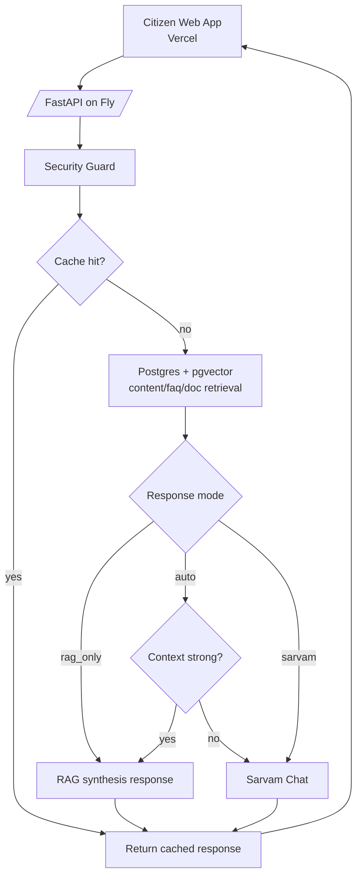

# Seva Sindu Gov Chatbot

AI-powered Indian Government Citizen Services assistant (Seva Sindhu style) built for multilingual text and voice support.

## What this project is

- Citizen-facing assistant for government service guidance (Passport, Aadhaar, PAN, EPFO, DigiLocker, DL, etc.).
- Retrieval-first architecture using official content chunks from PostgreSQL + pgvector.
- Multimodal support with Sarvam AI:
  - TTT: text query -> text response
  - TTS: text -> speech audio
  - STT: speech -> text transcript
  - STS: speech -> speech (STT -> response generation -> TTS)
- Auth stack with Clerk + backend session sync.

## Core stack

- Backend: FastAPI, SQLAlchemy, PostgreSQL, pgvector
- Frontend: Vite + React (`frontend/src` is canonical)
- AI provider: Sarvam AI (chat, STT, TTS)
- Auth: Clerk (`@clerk/clerk-react`) + local session token bridging
- Deployment: Fly.io app + Supabase PostgreSQL

## High-level architecture

## Voice flow

## Main API surfaces

- `POST /api/v1/chat` -> TTT chat with `response_mode` (`auto`, `rag_only`, `sarvam`)
- `POST /api/v1/speech-to-text` -> STT
- `POST /api/v1/text-to-speech` -> TTS
- `POST /api/v1/voice-chat` -> STS pipeline
- `POST /api/auth/clerk/sync` -> Clerk token verify + local session issue
- `GET /health` -> health check

## Latency strategy

- Security filtering before generation.
- Cache short-circuit for repeated queries.
- RAG-first in auto mode when context confidence is high.
- Sarvam fallback/generation only when needed.
- Startup warm-up to reduce embedding cold path.

## Data model notes

- `content_chunks` canonical columns include `chunk_text` and `chunk_type`.
- No `category` column and no `content_text` column in `content_chunks`.
- Vector dimensions are configured via `EMBEDDING_DIM` and must not be hardcoded.

## Quality and testing

- `test/test_phase65_live.py`: phase latency gates and reliability checks.
- `test/test_chatbot_full_suite.py`: comprehensive real-endpoint chatbot validation across multilingual prompts, messy user prompts, and TTT/TTS/STT/STS modalities.
- `test/test_clerk_sync_unit.py`: Clerk sync strategy and token verification unit coverage.

## Deployment shape

- API: Fly (`gov-chatbot.fly.dev`, Mumbai region)
- DB: Supabase PostgreSQL
- Frontend: Vercel (`seva-sindu-portal.vercel.app`)
